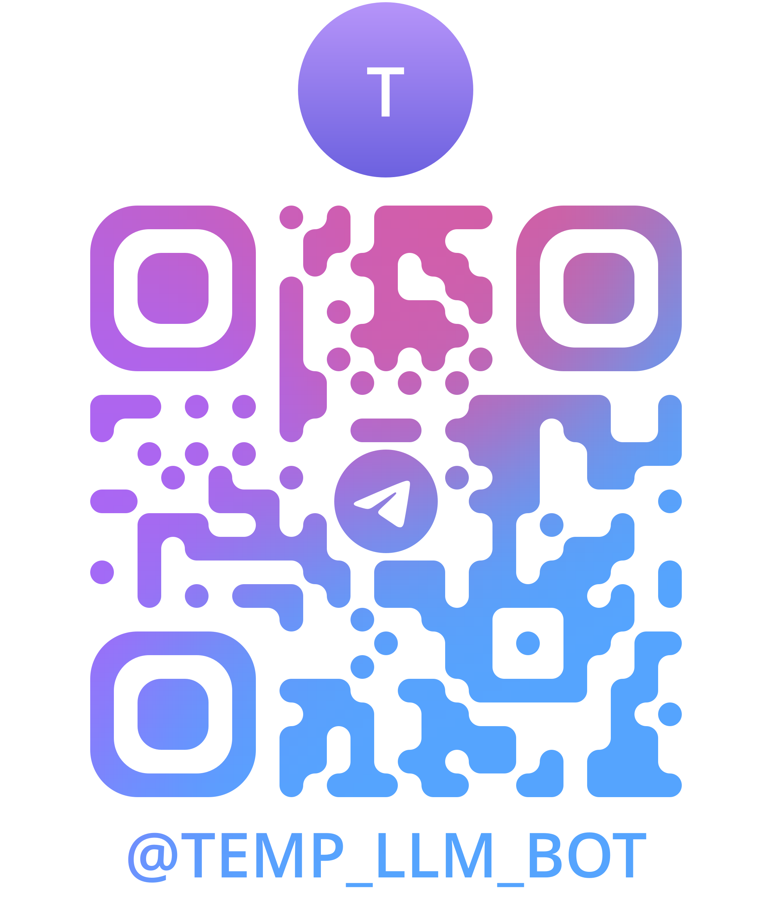

# Описание
Проект для проектного практикума УрФУ (2 курс, 1 cеместр). Заказчиком является DOUBLETAPP.

# LLM-Agent

**LLM-Agent** — это Telegram-бот, предназначенный для помощи в уходе за кожей лица, используя технологии LLM и OCR для анализа состава косметических средств и персонализированных рекомендаций.

Сканируйте QR-код ниже, чтобы запустить бота в Telegram:



## Основные функции

 1. **Сканирование состава косметического средства:**

    Бот распознает текст с фотографий упаковок или этикеток косметических средств с использованием технологии OCR, чтобы извлечь информацию о составе продукта.

 2. **Анализ состава:**

    Бот анализирует химический состав средства, выявляет потенциальные аллергены и компоненты, подходящие для различных типов кожи, опираясь на базы данных косметических ингредиентов.

 3. **Рекомендации по уходу:**

    На основе полученных данных бот предоставляет рекомендации по уходу за кожей, учитывая особенности пользователя (тип кожи, возраст, наличие проблем и т.д.).

 4. **История анализов:**

    Пользователь может просмотреть историю анализов продуктов для отслеживания реакций и улучшений в уходе за кожей.

## Установка и настройка

1. **Склонируйте репозиторий:**
```
git clone https://github.com/denisnaenko/LLM-Agent.git 
cd LLM-Agent
```

2. **Установите зависимости:**
```
pip install -r requirements.txt
```

3. **Настройте файл окружения .env с параметрами:**
 * `BOT_TOKEN`: токен Telegram-бота.
 * Другие настройки (например, базы данных) при необходимости.

4. **Запустите бота:**
```
python main.py
```

## Использование

* `/start`: Начало работы с ботом и вызов главного меню.
* `/help`: Описание всех функций бота.

## Лицензия

Этот проект лицензирован на условиях MIT License.